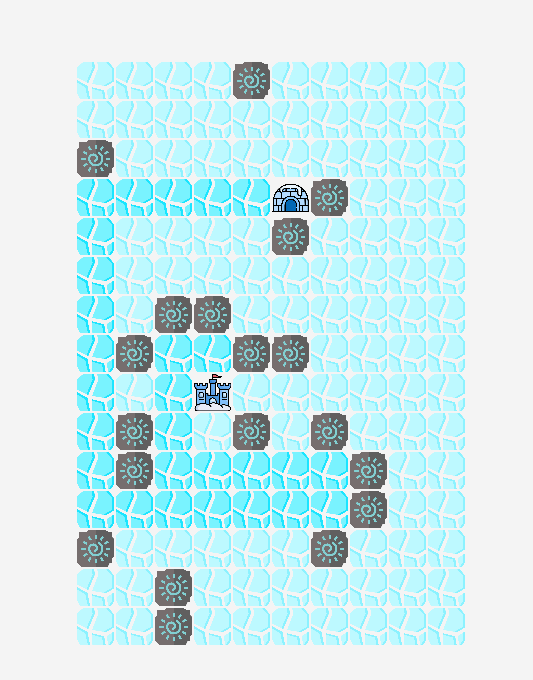
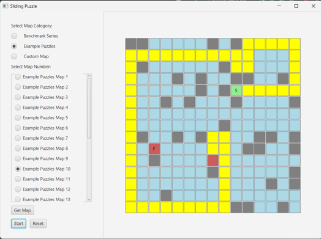

# 🧊 Ice Sliding Puzzle Solver

This project uses **A\* pathfinding algorithm** to solve a classic ice-sliding puzzle that appears in many video games.

## ❓ Problem Description

The game is played on a grid where:

- `S` is the **Start** position
- `F` is the **Finish** position
- `0` represents **rocks**
- `.` represents **frictionless ice**
- The player slides in a straight line until they hit a rock or the wall

Unlike standard grid movement, the player can't stop mid-slide. They can only change direction after coming to a stop.

### 🔍 Example Puzzle

<pre>
. . . . . 0 . . . S  
. . . . 0 . . . . .  
0 . . . . . 0 . . 0  
. . . 0 . . . . 0 .  
. F . . . . . . 0 .  
. 0 . . . . . . . .  
. . . . . . . 0 . .  
. 0 . 0 . . 0 . . 0  
0 . . . . . . . . .  
. 0 0 . . . . . 0 .  
</pre>


The goal is to find the shortest (or any valid) path from `S` to `F`, taking into account the special sliding mechanics.

## 💻 User Interface

> 📷 **Screenshot Preview**





## 🚀 Run the Project

Clone the repo and run the solver:

```bash
git clone https://github.com/your-username/ice-puzzle-solver.git
cd ice-puzzle-solver
python main.py
